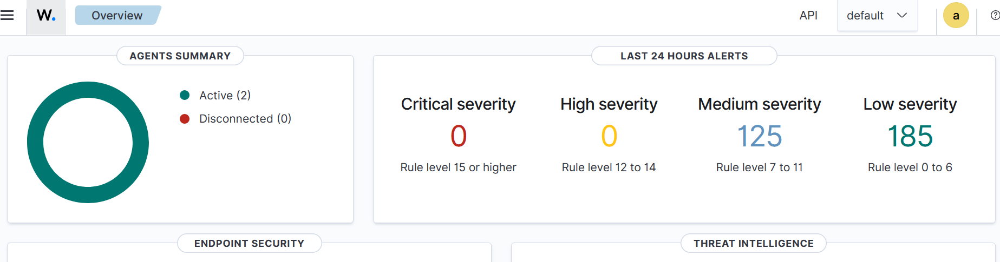

# 🛡️ Enterprise GRC Quantitative Risk Model

<h6>[ Python 3.10+ ] &nbsp; [ License: MIT ]</h6>

An enterprise-grade **IT GRC (Governance, Risk, and Compliance)** quantitative risk engine. This project shifts organizations away from ambiguous qualitative "Red/Yellow/Green" risk matrices and moves toward defensible, data-driven financial forecasting using **Monte Carlo simulations**.

🔗 **[View the Live Portfolio Page](https://spardman.github.io/enterprise-grc-risk-model/)**

---

## 🎯 Core Value Proposition

Traditional risk management relies on subjective guessing. This model injects mathematical rigor into cybersecurity by treating risk variables as statistical distributions, allowing C-suite executives to answer: *"What is our actual financial exposure in dollars if a data breach occurs this year?"*

### Key Capabilities
- **Loss Event Frequency (LEF):** Modeled using Poisson distributions.
- **Loss Event Magnitude (LEM):** Modeled using Log-Normal distributions to capture extreme impact tails.
- **Monte Carlo Engine:** Simulates 10,000+ organizational years to forecast annual loss exposure.

---

## 💻 Tech Stack & Architecture

- **Language:** Python 3.10+
- **Data Science Libraries:** `numpy`, `pandas`, `matplotlib`, `scipy`
- **Statistical Foundations:** Risk Analysis Framework (similar to FAIR principles)

---

## 📊 Telemetry & Real-World Data Inputs

Rather than relying purely on theoretical numbers, this risk engine is built to ingest threat parameters from live enterprise monitoring environments. 

The dashboard below showcases active telemetry data from an operational **Wazuh SIEM/XDR** instance, tracking real-time alert logs to help calculate data inputs for our **Loss Event Frequency (LEF)** models:

---

## 🚀 Getting Started

### 1. Installation
Clone the repository and install the standard numerical dependencies:
\`\`\`bash
git clone https://github.com
cd enterprise-grc-risk-model
pip install -r requirements.txt
\`\`\`

### 2. Running a Risk Simulation
To execute the core engine and generate risk visualization outputs, run:
\`\`\`bash
python quantify_risk.py --simulations 10000
\`\`\`

---

## 📊 Sample Outputs & Visualizations

### Annual Loss Exposure Distribution
*Place a screenshot or description of your generated risk graphs here!*

| Risk Metric | Value (USD) | Description |
| :--- | :--- | :--- |
| **Average Expected Loss** | $240,000 | The mean loss expected per operating year. |
| **95th Percentile (VAR)** | $1.2M | Value at Risk: The maximum loss expected with 95% confidence. |

---

## 👨‍💻 About the Author

I am **Dwan Edwards**, an Enterprise Cybersecurity Strategy & GRC Analyst with over 15 years of technical leadership experience. I specialized this project to demonstrate how data science can solve modern compliance and security challenges.

- **LinkedIn:** [dwan-edwards](https://linkedin.com)
- **Professional Blog:** [Read My Cybersecurity Journey](https://github.ioblog.html)

